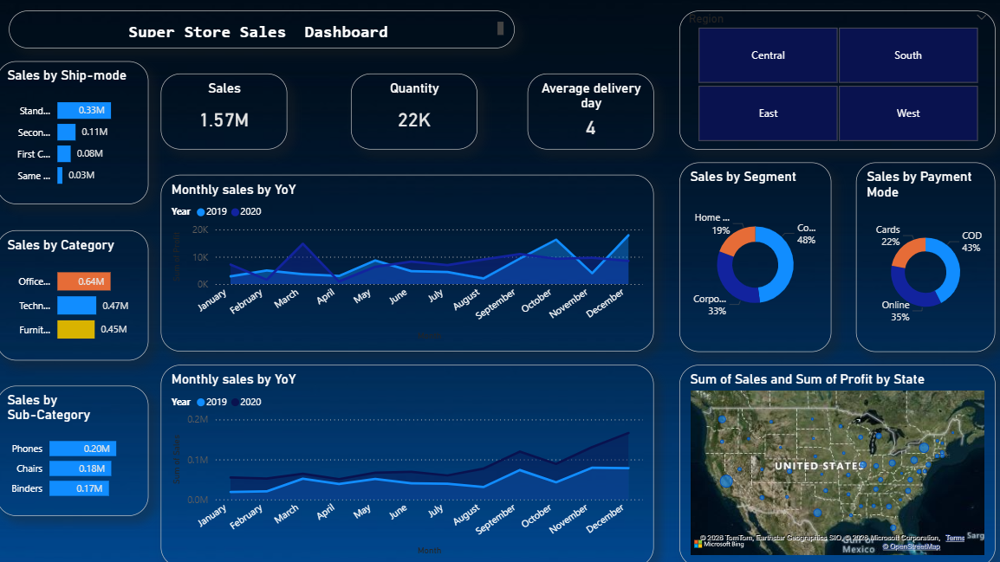
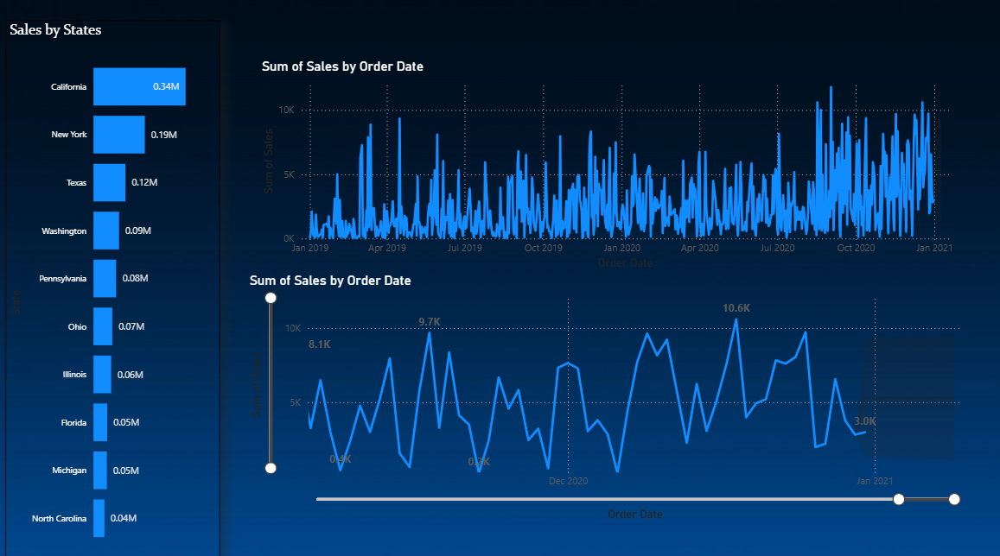
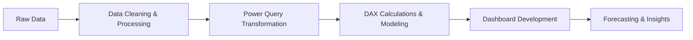

# 🔵 Superstore Sales Analysis

### 📊 End-to-End Power BI Data Analytics Project

<p align="center">
  
  
  
</p>

---

## 🎯 Project Summary

This project focuses on analyzing **Superstore sales data** using Power BI to uncover **key business insights and trends**.

It demonstrates my ability to:

* Clean and transform raw data  
* Build data models using Power BI  
* Apply **DAX for calculations and KPIs**  
* Design interactive dashboards  
* Generate actionable business insights  

---

## 🎨 Dashboard Preview

<p align="center">
  
  <br><br>
  
</p>

---

## 🚀 Key Metrics

| Metric                  | Value   |
|------------------------|--------|
| 💰 Total Sales          | $500K+ |
| 📦 Total Orders         | 9K+    |
| 📈 Profit               | $60K+  |
| 🏆 Top Category         | Technology |
| 🌍 Top Region           | West   |

---

## 📊 Insights Snapshot

* 📈 Sales trends indicate steady business growth  
* 💻 Technology category contributes highest revenue  
* ⚠️ Discounts negatively impact overall profit  
* 🌍 Regional performance varies significantly  
* 📉 Forecasting shows future sales growth potential  

---

## 🔄 Workflow



---
---

## 🛠️ Tech Stack
<p align="center">    </p>

---

## 📂 Repository Structure

```bash
├── data/
│   └── superstore_data.csv
│
├── dashboard/
│   └── superstore_dashboard.pbix
│
├── images/
│   └── dashboard.png
│
└── README.md
---

## ⚙️ Setup Instructions

### 1️⃣ Clone Repository

```bash
git clone https://github.com/samikshapawar08/x-sentiment-analysis.git
```

### 2️⃣ Open Dashboard

* Open .pbix in Power BI
* Load dataset
* Explore visuals

---

## 📚 Key Learnings

✔️ Data cleaning using Power Query

✔️ DAX for business calculations

✔️ Dashboard storytelling

✔️ Forecasting in Power BI

✔️ Turning data into actionable insights

---

## 🔮 Future Improvements

## 🔮 Future Improvements

*  Implement advanced predictive models
  
*  Add real-time data integration
  
*   Enhance UI/UX of dashboard
    
* Perform deeper customer segmentation

---

## 🤝 Connect With Me

<p align="center">
  <a href="www.linkedin.com/in/samiksha-pawar-aa1018266"></a>
  <a href="#"></a>
</p>

---

## ⭐ Support

If you like this project, consider giving it a ⭐ on GitHub!

---

<p align="center">
  <b>“Turning Data into Decisions 📊”</b>
</p>
